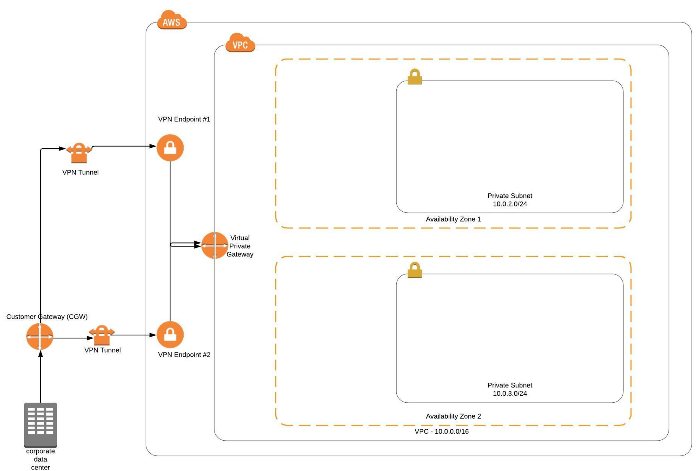

# Lesson 3 - Network Stack
In the project the Network infrastructure of the following app is deployed to AWS using cloud formation


```shell script
./deploy-stack.sh demo network.yml network-params.json
```

## Exercise 
A VPN Network Stack to connect On-Premise Infrastructure to AWS VPC


```shell script
./deploy-stack.sh vpndemo exercise/vpnnetwork.yml exercise/vpnnetwork-params.json
```