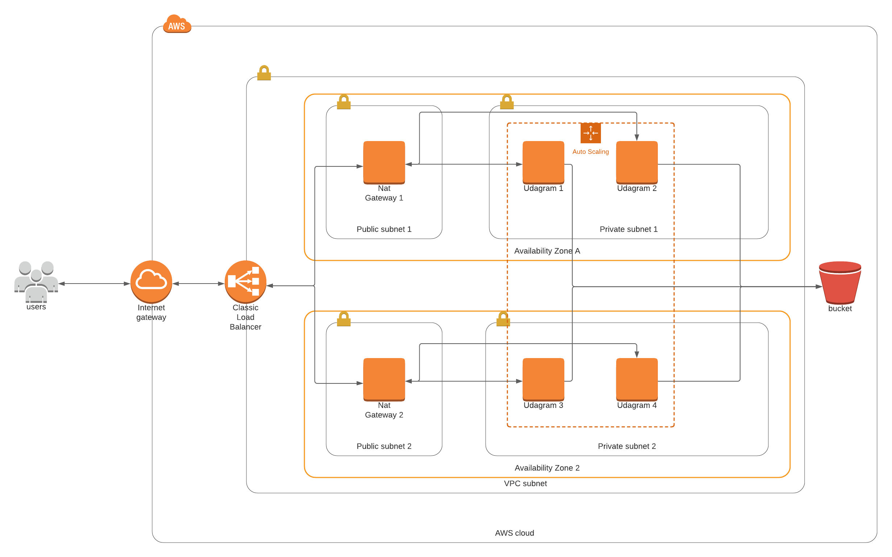

# Deploy a high-availability web app using CloudFormation
This project deploys an application to Apache Servers running inside Docker Containers located in EC2 instances created using a LaunchConfiguration.
- It uses AutoScaling and LoadBalancing.
- The EC2 instance downloads the application from a S3 Bucket. Even though the S3 Bucket is a public service, the objects inside are private, to get access from the EC2 instance an InstanceProfile was created. 




```shell script
./deploy-stack.sh udagram-bucket s3.yml s3-params.json 
# once the s3 bucket is created, add the zip file
aws s3 cp app.zip s3://${bucket-name}/

# create network stack
./deploy-stack.sh udagram-network network.yml network-params.json
# create servers
./deploy-stack.sh udagram-server servers.yml servers-params.json
```